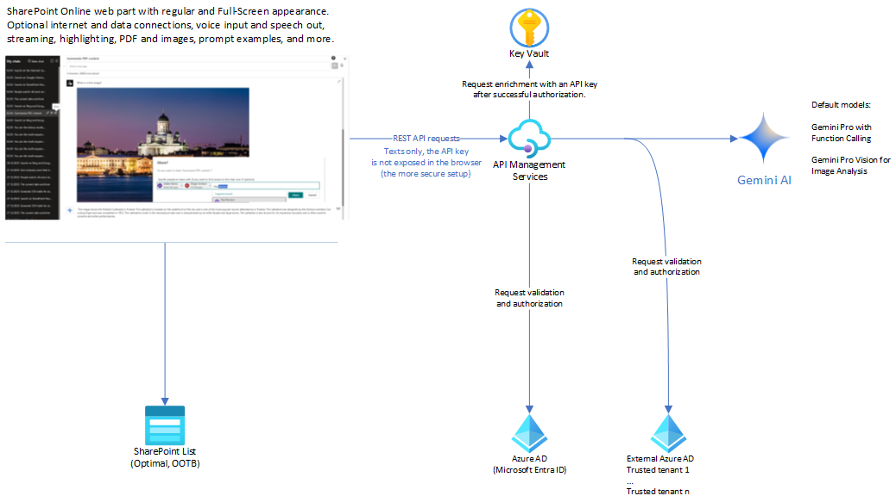
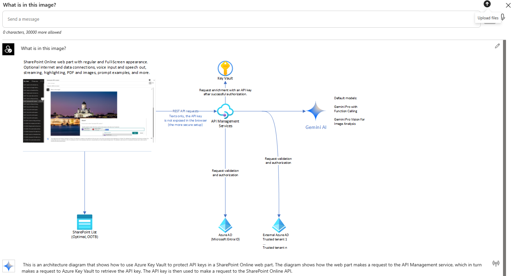

# Gemini AI Chat web part

This is a Gemini AI Chat Web Part for SharePoint Online, offering a user experience that is similar to [Azure OpenAI Chat Web Part](https://github.com/Paul-Borisov/Azure-OpenAI-Chat-Webpart), which I published earlier.
- SPFx 1.18, React, Gemini AI Pro / Pro Vision, optional Azure API Management configurations to resolve Gemini AI access restrictions for European locations (as of January 2024).
- The setup and configurations are similar to Azure OpenAI Chat Web Part.

**Data Privacy**

Gemini AI is the latest and most capable AI model published by Google. Any data provided to endpoints of Gemini AI goes to external service locations. Gemini AI is not yet [GDPR-compliant](https://thenextweb.com/news/google-gemini-ai-unavailable-europe-uk).
- RESTful endpoints of Gemini AI can be accessed using a free API key generated via [Google AI Studio](https://makersuite.google.com/app/apikey).

### Full-Scale Setup

**Key features**
- [Presentation](docs/gemini-ai-chat-web-part-presentation.pdf)
- Default support of Gemini Pro and Gemini Pro Vision
- Chat history stored into a SharePoint Custom List with the optional data encryption (off by default)
- Integration with Azure API Management Service to provide seamless access from European and UK locations; more details are provided below.
- Global and Private Chat Sharing for selected Azure AD accounts
- Full-Screen Mode
- Event Streaming
- Code Highlighting with Configurable Styles
- Unlimited Length of Chat History (Configurable)
- Upper and Lower side positioning for the Prompt Text Area
- Analysis of an uploaded PDF and summarization of its content (gemini-pro)
- Analysis of uploaded images and description of their content (gemini-pro-vision)
- Optional dropdown box with examples for prompt text.
- Optional voice input to prompt text.
- Optional speech synthesis to read out AI-generated texts by default. The standard Web Speech API requires selecting the preferred language; using default page language is not always optimal.
- Optional data encryption for Chats data.
- Configurable Formats for Dates: Default is Finnish, which can be changed to "en-US" in Web Part Settings.

**Data integrations**

The web part supports optional integrations with external data using the Function Calling feature of Gemini Pro. These integrations are disabled by default and must be enabled in the web part settings.

The integrations available in the first release include:
- SharePoint Search
- Company Users
- Local Date and Time
- Search on the Internet: Bing and Google (+ Reddit).
  - The configuration is supported in two alternatives:
    - 1. Using the additional APIM-endpoints https://**apiminatance**.azure-api.net/**bing** and/or https://**apiminatance**.azure-api.net/**google**
    - 2. Using the direct Bing and Google endpoints with own **api-key** values stored in the web part settings (less secure).

## Users in Europe and UK

As of January 2024, users from European and UK locations do not have direct access to Google AI Studio.
- To obtain the API key from those locations, you can use any VPN service to connect to permitted ones like US.
- To access the endpoints with the API key from restricted locations you should also use a VPN connection, which is not convenient.

**Configuration**

This web part supports the default option to interact with **Gemini AI** endpoints published via Azure API Management service instance (APIM)
- This instance can be deployed to US zone to suppress location-based access restrictions.
- Base URL for Gemini AI: https://**apiminatance**.azure-api.net/**geminiai**. Two operations must be created under the base:
  - /chat
  - /vision
- APIM consistently validates identities of SharePoint users for each individual request. If the request originates from authorized domains, APIM retrieves the **api-key** from the secure vault and injects it into the request before forwarding it to the AI endpoint. This process ensures that the api-key does not get exposed in the browser.

To configure the SharePoint list storage use the web part properties and

- Click on the Create button under SharePoint list URL
- Click on the Create button under Image library URL

Chats are private and visible only to their creators. Creators have the option to share their chats when this feature is enabled in the web part settings (disabled by default).
- Creators can share their chats with everyone or only with specific people in the company.

In the simplest case, you can also use direct access to Gemini AI endpoints, configured with an API key explicitly stored in the web part properties.
- Base URL for Gemini AI: https://generativelanguage.googleapis.com/v1beta
  - v1beta prodides the optional Function Calling feature of Gemini Pro while v1 does not include it yet.
- **This setup, while the least secure, can provide a quicker start.** It is not recommended for production use, but it can be used for quick tests or in situations where you do not have access to Azure API Management.
- The stored key is encrypted in the web part properties and displayed as \*\*\* in the Property Pane.
  However, it will travel in browser requests and can be viewed within the DEV tools > Network > Request headers.
- If you are located in Europe or UK, you should use a VPN to connect to Gemini AI endpoints in this setup.

# Table of Content

- [Key features](../../releases/tag/Version1.0)

- [Get Started Quickly in Visual Studio Code (DEV)](#get-started-quickly-in-visual-studio-code-dev)

- [Get Started Quickly with a prebuilt web part package](#get-started-quickly-with-a-prebuilt-web-part-package)

- [More Advanced Setup](#more-advanced-setup)

### User Interface

")

# Get Started Quickly in Visual Studio Code (DEV)

- [back to the top](#table-of-content)

This is the simplest and least secure setup.
You will not be able to use the Private Chat sharing and People Search features unless you approve the corresponding [SPFx permissions](#spfx-permissions).

**Prerequisites**:

- Visual Studio Code with a development setup for building SPFx components, versions 1.16.1 - 1.18.0.
- You should generate a free **API key** for Gemini AI via [Google AI Studio](https://makersuite.google.com/app/apikey).
  - If you are in EU or UK zones, you can use any [VPN to connect](#users-in-europe-and-uk) and obtain the key.
  
## Configurations

1. Clone the project.

2. Open the project in Visual Studio Code and navigate to View > Terminal

3. Execute the following commands

   - cd ./spfx-latest
   - npm i
   - gulp build
   - gulp serve --nobrowser
     - Alternatively, you can use fast-serve
   - npm run serve

4. Create a Site Page in SharePoint Online and open it in "debug mode" using a format like:

   - `https://yourtenant.sharepoint.com/sites/yoursite/SitePages/yourpage.aspx?debug=true&noredir=true&debugManifestsFile=https://localhost:4321/temp/manifests.js`

5. Edit the page and add the Gemini AI Chat web part.

6. Open the web part settings and configure the minimal set of required properties as follows:

   - **Client ID: create a user_impersonation app with name=geminiaiwp**: keep the default "zero" value or leave it empty.

   - **Base URL for Gemini AU endpoint (APIM API or full)**:
       - https://generativelanguage.googleapis.com/v1beta
       - You must have an API key tp access the endpoints.

   - **Optional api-key for Gemini AI (for troubleshooting, not for Production)**: add your api-key

     - The key will be encrypted and stored in the web part settings (and displayed as \*\*\* in the Property Pane).

   - **Storage type for chat history**: keep the default SharePoint list.

   - **SharePoint list URL (leave it empty for default URL)**: leave it empty and click the Create button if you opt to use SharePoint list storage.

     - This will create a custom list, dbChatsGemini, in the current site collection.

       - By default, the chat sharing option is disabled.
       - If you enable it using the corresponding checkbox below the field, click on the Update button to adjust the list's permissions.
       - The used list template can be found in the [package](package/dbChatsGemini.xml).

  - **Enable integrations**: select it
    - Go to the setting **Image library URL (leave it empty for default URL)** below and click on the Create button.
    - This will create an image library ChatsImages in the current site collection. This library will be used to store images to be processed by Gemini Pro Vision.
      
  - **Enable integrations**: you can unselect it after creating the image library.

7. Save web part settings. Reload the page.

8. Test the setup by adding any text into the prompt text area, then pressing Enter or clicking the Submit button.
   - The AI-response should appear in the content area below.
   - Click on the upward arrow in the right-hand corner. Select any PDF file - for instance, from ./docs folder - and click OK to upload it. Click on the Submit button to summarize the uploaded PDF.
   - Click on the upward arrow in the right-hand corner. Select any PNG or JPG file - for instance, from ./docs folder - and click OK to upload it. Click on the Submit button to analyse the uploaded image with Gemini Pro Vision.

# Get Started Quickly with a prebuilt web part package

- [back to the top](#table-of-content)

This is the simplest standalone setup.
You will not be able to use the Private Chat sharing and People Search features unless you approve the corresponding [SPFx permissions](#spfx-permissions).

**Prerequisites**:

- You should be a site collection administrator or hold the role of SharePoint Administrator to create a new site.
- You should generate a free **API key** for Gemini AI via [Google AI Studio](https://makersuite.google.com/app/apikey).
  - If you are in EU or UK zones, you can use any [VPN to connect](#users-in-europe-and-uk) and obtain the key.

## Configurations

1. Download the latest [release package](../../releases/download/Version1.0/gemini-ai-chat.sppkg) or compile it from the source code in **spfx-latest**.

2. Create a site collection in SharePoint Online and an App Catalog for it.

   - PnP.PowerShell: [Add-PnPSiteCollectionAppCatalog](https://learn.microsoft.com/en-us/powershell/module/sharepoint-online/add-spositecollectionappcatalog?view=sharepoint-ps)
   - Alternatively, to simplify the process, just deploy the package into the global App Catalog of your tenant.

3. Upload the package into the App Catalog.

   - Add the app **Gemini AI Chat Web Part** to the site. Please ignore the warning about the required access permissions.

4. Add a new Site Page and the web part **Gemini AI Chat** to it.

5. Open the web part settings and configure the minimal set of required properties.
   - Please refer to steps 6, 7, 8 from [Get Started Quickly in Visual Studio Code (DEV)](#get-started-quickly-in-visual-studio-code-dev)

# More Advanced Setup

To be added later...
